# Тестування працездатності системи

## Запуск сервера

## Тестування для опитувань

### GET /quiz

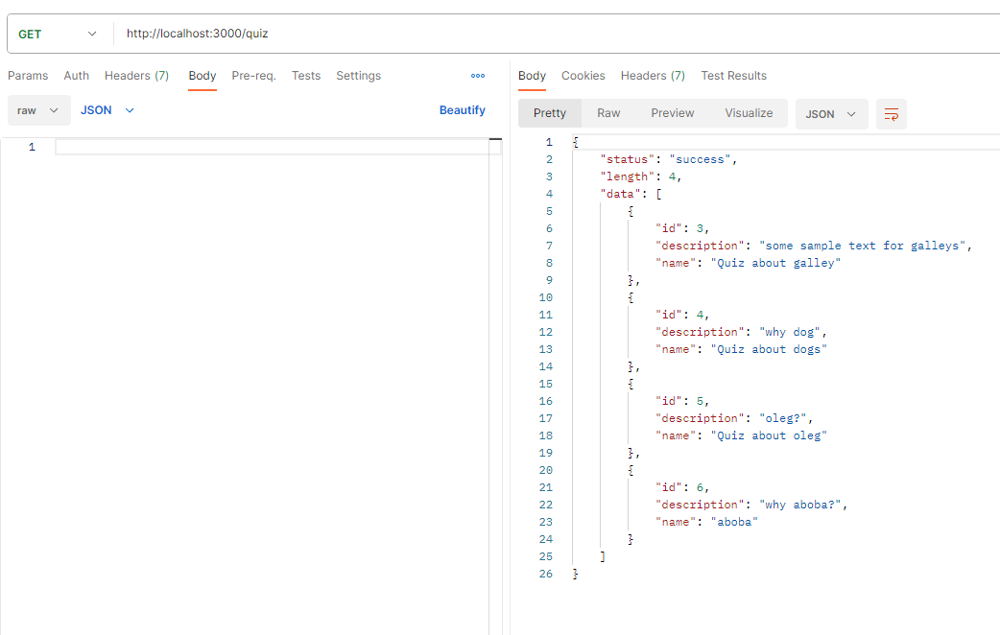
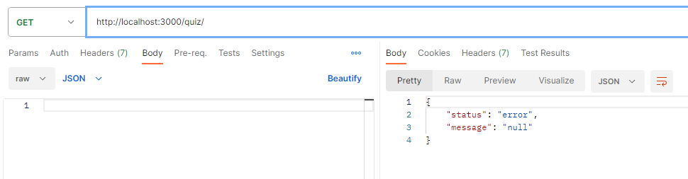

### GET /quiz/:id

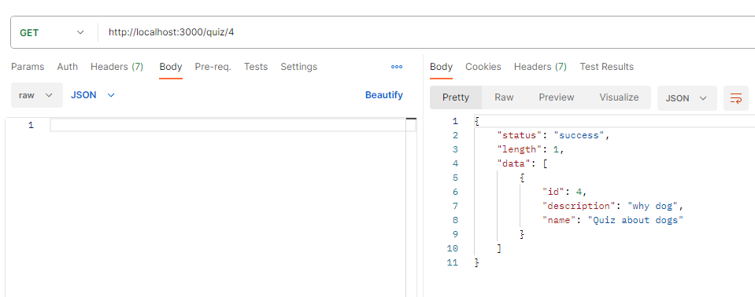
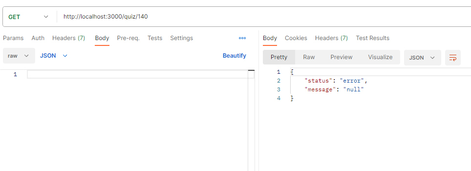

### POST /quiz

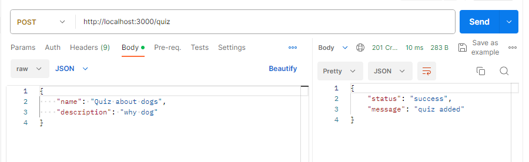
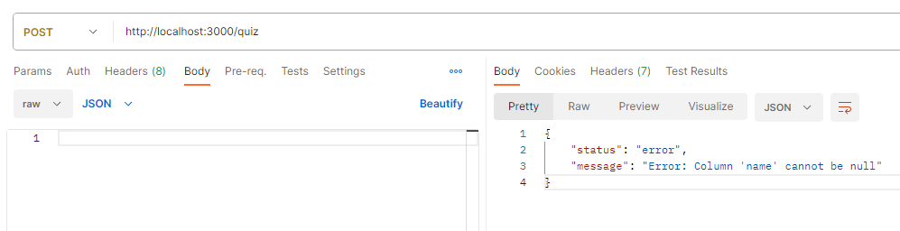

### PUT /quiz/:id

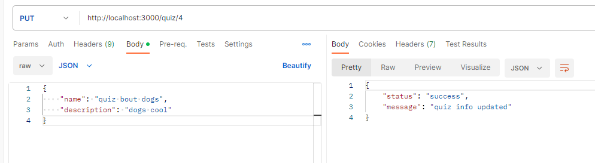

### DELETE /quiz/:id

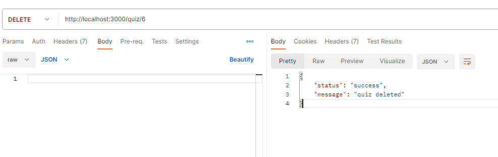

## Тестування для питань

### GET /question

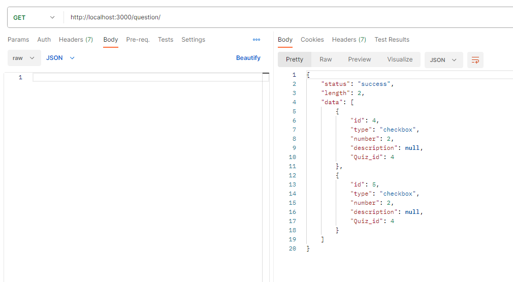
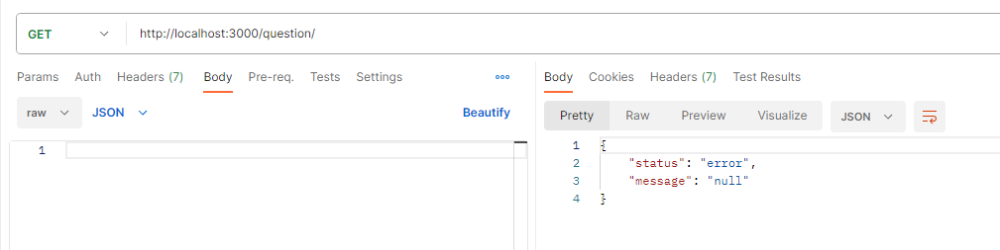

### GET /question/:id

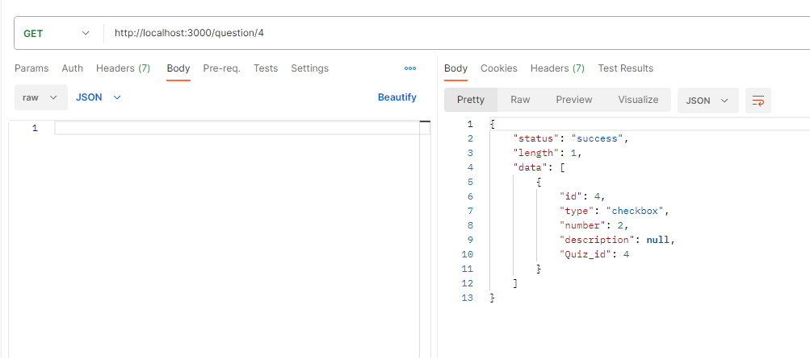
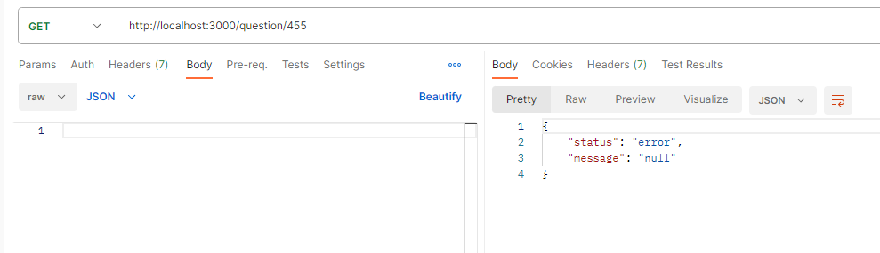

### POST /question

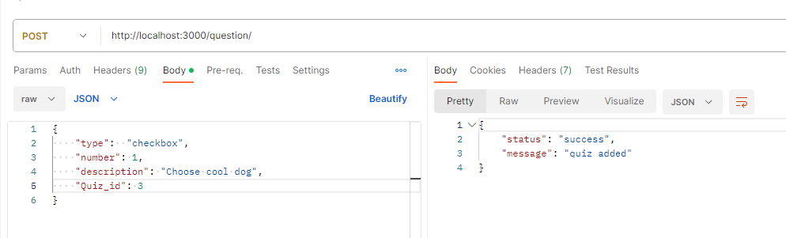
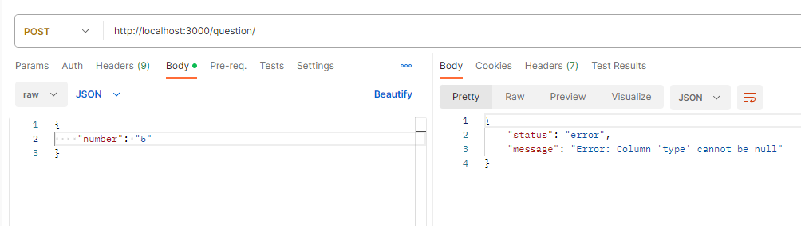

### PUT /question/:id

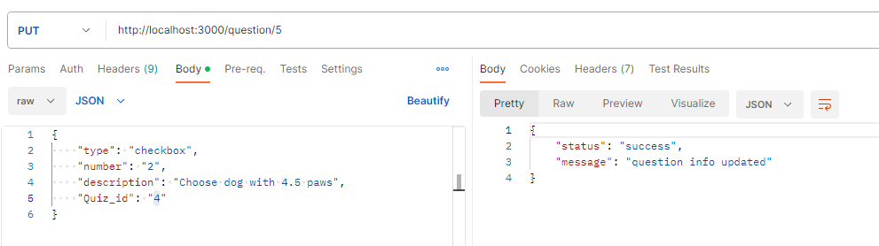

### DELETE /question/:id

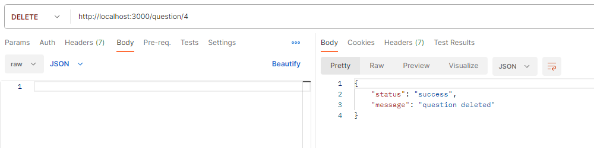

